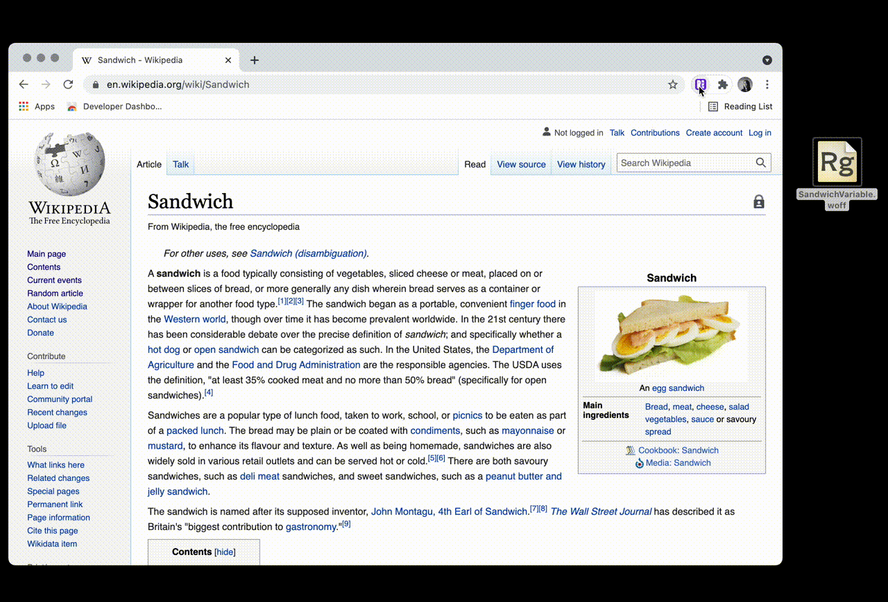
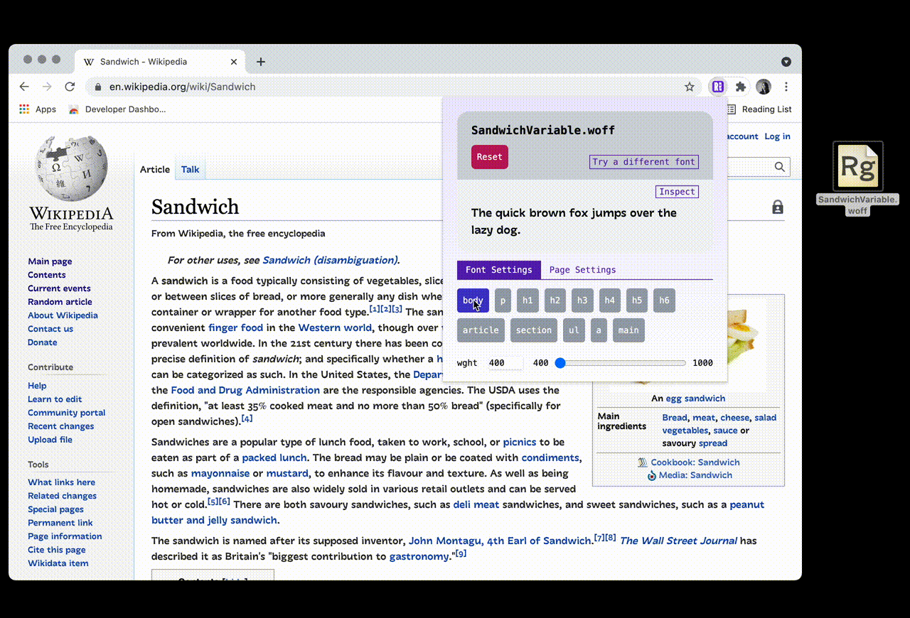
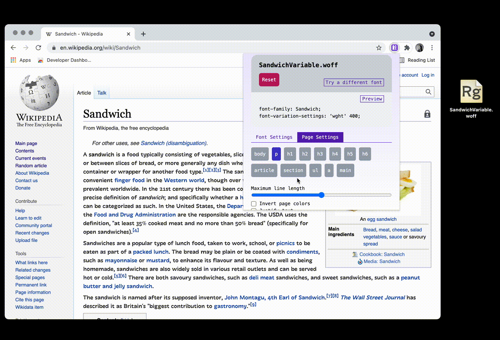

# TypeTuner

TypeTuner is a web extension for previewing local variable and static fonts in context. The alpha version is available in the Chrome Web Store.

## Features

### Apply local font to a web page
To use a local font on the web page, drag the font file into the drop area. After the font is loaded, the values for variable font axes can be customized.

### Target font changes to certain elements
To target specific elements on the page, toggle the element button under "Font Settings" tab.

### Customize basic page settings
To customize line length, page color and text justification, select "Page Settings" tab.

## Bugs & Feature Requests

To file bugs or request new features, please file a new issue [here](https://github.com/mewoph/typetuner-extension/issues) or feel free to email me at [hi@mewoph.xyz](mailto:hi@mewoph.xyz).

## Contributing

See [contribution guide](CONTRIBUTING.md) here.

